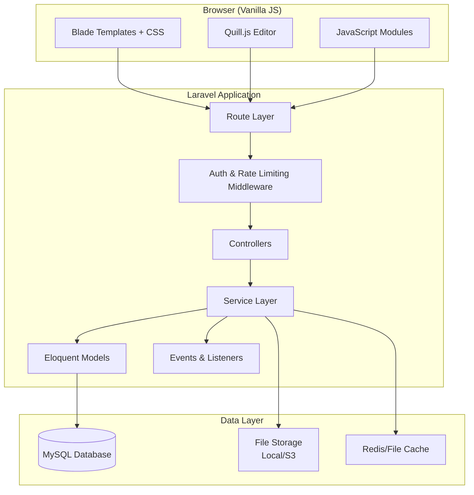
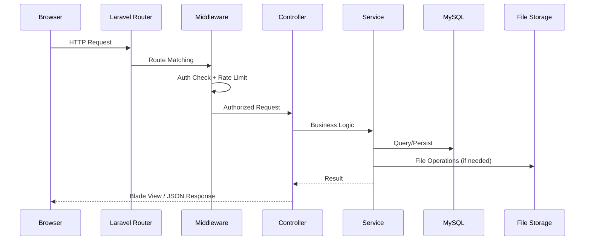
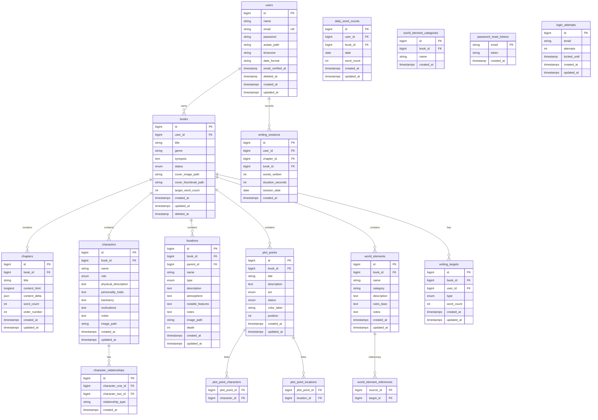

# Design Document: Novel Writing Platform

## Overview

The Novel Writing Platform is a full-stack web application built with PHP/Laravel (backend), MySQL (database), and vanilla JavaScript (frontend). It provides authors with a comprehensive suite of tools for writing, organizing, and managing novels — including a rich text editor, character/location builders, plot outlining, writing targets, statistics tracking, world-building tools, and data export.

The platform adopts the Treto design theme: Jost font family, #fa4729 accent color, bordered frames with offset box-shadows, dotted background patterns, and uppercase headings. The architecture follows Laravel's MVC pattern with Blade templates, RESTful API routes, and progressive enhancement via vanilla JS.

### Key Design Decisions

1. **Server-rendered with progressive enhancement**: Blade templates handle initial rendering; vanilla JS adds interactivity (auto-save, drag-and-drop, real-time word counts) without a SPA framework.
2. **Laravel's built-in auth scaffolding**: Leverages Laravel Breeze for authentication flows (registration, login, password reset, email verification).
3. **Quill.js for rich text editing**: Lightweight, extensible, stores content as Delta JSON internally and renders as HTML.
4. **MySQL with Eloquent ORM**: Relational data model with proper foreign keys, soft deletes for safety, and indexed search columns.
5. **File storage via Laravel's filesystem abstraction**: Supports local disk in development, S3-compatible storage in production.
6. **No SPA routing**: Traditional page navigation with Turbolinks-style partial page loads for snappy transitions.

---

## Architecture

### High-Level System Architecture



### Request Flow



### Module Decomposition

| Module | Responsibility |
|--------|---------------|
| Auth | Registration, login, logout, password reset, session management |
| Books | CRUD for books, cover image management, status transitions |
| Chapters | CRUD, ordering, word count tracking |
| Editor | Rich text editing, auto-save, content persistence |
| Characters | Character profiles, relationships, reference images |
| Locations | Location profiles, hierarchy, reference images |
| Plot | Plot points, timeline, character/location linking |
| Targets | Daily/weekly writing goals, progress calculation |
| Statistics | Word counts, streaks, sessions, charts |
| WorldBuilding | Custom world elements, categories, cross-references |
| Export | Book/chapter export to TXT/Markdown |
| Search | Full-text search across book content |
| Settings | Account management, preferences, avatar |
| Dashboard | Overview, recent activity, quick stats |

---

## Components and Interfaces

### Backend Components (Laravel)

#### Controllers

```php
// App\Http\Controllers\Auth
AuthController::register(Request $request): RedirectResponse
AuthController::login(Request $request): RedirectResponse
AuthController::logout(Request $request): RedirectResponse
AuthController::forgotPassword(Request $request): RedirectResponse
AuthController::resetPassword(Request $request): RedirectResponse

// App\Http\Controllers
DashboardController::index(): View
BookController::index(): View
BookController::store(StoreBookRequest $request): RedirectResponse
BookController::show(Book $book): View
BookController::update(UpdateBookRequest $request, Book $book): RedirectResponse
BookController::destroy(Book $book): RedirectResponse
BookController::uploadCover(UploadCoverRequest $request, Book $book): JsonResponse
BookController::removeCover(Book $book): JsonResponse

ChapterController::store(Book $book): JsonResponse
ChapterController::update(UpdateChapterRequest $request, Chapter $chapter): JsonResponse
ChapterController::destroy(Chapter $chapter): JsonResponse
ChapterController::reorder(ReorderRequest $request, Book $book): JsonResponse
ChapterController::saveContent(SaveContentRequest $request, Chapter $chapter): JsonResponse

CharacterController::index(Book $book): View
CharacterController::store(StoreCharacterRequest $request, Book $book): JsonResponse
CharacterController::update(UpdateCharacterRequest $request, Character $character): JsonResponse
CharacterController::destroy(Character $character): JsonResponse
CharacterController::uploadImage(Request $request, Character $character): JsonResponse
CharacterController::relationships(Book $book): JsonResponse

LocationController::index(Book $book): View
LocationController::store(StoreLocationRequest $request, Book $book): JsonResponse
LocationController::update(UpdateLocationRequest $request, Location $location): JsonResponse
LocationController::destroy(Location $location): JsonResponse
LocationController::uploadImage(Request $request, Location $location): JsonResponse
LocationController::hierarchy(Book $book): JsonResponse

PlotController::index(Book $book): View
PlotController::store(StorePlotPointRequest $request, Book $book): JsonResponse
PlotController::update(UpdatePlotPointRequest $request, PlotPoint $plotPoint): JsonResponse
PlotController::destroy(PlotPoint $plotPoint): JsonResponse
PlotController::reorder(ReorderRequest $request, Book $book): JsonResponse

WritingTargetController::store(StoreTargetRequest $request, Book $book): JsonResponse
WritingTargetController::update(UpdateTargetRequest $request, WritingTarget $target): JsonResponse

StatisticsController::show(Book $book): View
StatisticsController::heatmap(Request $request): JsonResponse
StatisticsController::progressChart(Book $book): JsonResponse

WorldElementController::index(Book $book): View
WorldElementController::store(StoreWorldElementRequest $request, Book $book): JsonResponse
WorldElementController::update(UpdateWorldElementRequest $request, WorldElement $element): JsonResponse
WorldElementController::destroy(WorldElement $element): JsonResponse

ExportController::book(ExportRequest $request, Book $book): StreamedResponse
ExportController::chapter(ExportRequest $request, Chapter $chapter): StreamedResponse

SearchController::search(SearchRequest $request, Book $book): JsonResponse

SettingsController::show(): View
SettingsController::updateProfile(UpdateProfileRequest $request): RedirectResponse
SettingsController::updatePassword(UpdatePasswordRequest $request): RedirectResponse
SettingsController::uploadAvatar(Request $request): JsonResponse
SettingsController::deleteAccount(Request $request): RedirectResponse
SettingsController::updatePreferences(Request $request): RedirectResponse
```

#### Service Layer

```php
// App\Services
class BookService {
    public function create(User $user, array $data): Book;
    public function update(Book $book, array $data): Book;
    public function delete(Book $book): void;
    public function uploadCover(Book $book, UploadedFile $file): string;
    public function removeCover(Book $book): void;
    public function generateThumbnail(string $imagePath): string;
    public function calculateWordCount(Book $book): int;
}

class ChapterService {
    public function create(Book $book): Chapter;
    public function updateContent(Chapter $chapter, string $content): Chapter;
    public function reorder(Book $book, array $order): void;
    public function delete(Chapter $chapter): void;
    public function calculateWordCount(Chapter $chapter): int;
}

class EditorService {
    public function saveContent(Chapter $chapter, array $delta, string $html): Chapter;
    public function stripUnsupportedFormatting(string $html): string;
}

class CharacterService {
    public function create(Book $book, array $data): Character;
    public function update(Character $character, array $data): Character;
    public function delete(Character $character): void;
    public function addRelationship(Character $char1, Character $char2, string $type): CharacterRelationship;
    public function removeRelationship(CharacterRelationship $rel): void;
    public function getRelationshipMap(Book $book): array;
}

class LocationService {
    public function create(Book $book, array $data): Location;
    public function update(Location $location, array $data): Location;
    public function delete(Location $location): void;
    public function getHierarchyTree(Book $book): array;
    public function reassignChildren(Location $location): void;
}

class PlotService {
    public function create(Book $book, array $data): PlotPoint;
    public function update(PlotPoint $point, array $data): PlotPoint;
    public function delete(PlotPoint $point): void;
    public function reorder(Book $book, array $order): void;
    public function linkCharacters(PlotPoint $point, array $characterIds): void;
    public function linkLocations(PlotPoint $point, array $locationIds): void;
}

class WritingTargetService {
    public function setTarget(Book $book, string $type, int $wordCount): WritingTarget;
    public function getDailyProgress(Book $book, User $user): array;
    public function getWeeklyProgress(Book $book, User $user): array;
    public function checkTargetMet(Book $book, User $user, string $type): bool;
}

class StatisticsService {
    public function getTotalWordCount(Book $book): int;
    public function getCurrentStreak(User $user): int;
    public function getLongestStreak(User $user): int;
    public function getAverageDailyWords(User $user, int $days = 30): int;
    public function getHeatmapData(User $user, int $months = 12): array;
    public function getProgressChartData(Book $book, int $days = 30): array;
    public function recordSession(User $user, Chapter $chapter, int $wordsWritten, int $durationSeconds): WritingSession;
    public function getEstimatedCompletion(Book $book, User $user): ?Carbon;
}

class WorldBuildingService {
    public function create(Book $book, array $data): WorldElement;
    public function update(WorldElement $element, array $data): WorldElement;
    public function delete(WorldElement $element): void;
    public function addCrossReference(WorldElement $source, WorldElement $target): void;
    public function removeCrossReference(WorldElement $source, WorldElement $target): void;
    public function getGroupedByCategory(Book $book): Collection;
}

class ExportService {
    public function exportBookAsText(Book $book): string;
    public function exportBookAsMarkdown(Book $book): string;
    public function exportChapterAsText(Chapter $chapter): string;
    public function exportChapterAsMarkdown(Chapter $chapter): string;
    public function htmlToPlainText(string $html): string;
    public function htmlToMarkdown(string $html): string;
}

class SearchService {
    public function search(Book $book, string $query, int $limit = 50): array;
    public function searchChapters(Book $book, string $query): Collection;
    public function searchCharacters(Book $book, string $query): Collection;
    public function searchLocations(Book $book, string $query): Collection;
    public function searchPlotPoints(Book $book, string $query): Collection;
    public function searchWorldElements(Book $book, string $query): Collection;
    public function generateSnippet(string $content, string $query, int $contextLength = 120): string;
}
```

#### Middleware

```php
// App\Http\Middleware
class EnsureAuthenticated       // Redirects unauthenticated users to login
class RateLimitLogin            // 5 attempts per 15 minutes per email
class RateLimitPasswordReset    // 5 requests per 15 minutes per email
class EnsureBookOwnership       // Verifies the authenticated user owns the book
class SessionTimeout            // Expires sessions after 120 minutes of inactivity
```

### Frontend Components (Vanilla JS Modules)

```javascript
// resources/js/modules/

// editor.js - Quill editor initialization and auto-save
EditorModule.init(chapterId, saveEndpoint)
EditorModule.save()              // Manual save (Ctrl+S)
EditorModule.autoSave()          // 30-second interval auto-save
EditorModule.getWordCount()      // Real-time word count
EditorModule.toggleFullscreen()  // Distraction-free mode
EditorModule.handlePaste(event)  // Strip unsupported formatting

// drag-drop.js - Chapter and plot point reordering
DragDropModule.init(container, endpoint)
DragDropModule.handleDragStart(event)
DragDropModule.handleDrop(event)
DragDropModule.persistOrder(items)

// search.js - Book-wide search
SearchModule.init(bookId)
SearchModule.query(searchTerm)
SearchModule.renderResults(results)
SearchModule.highlightMatch(text, query)

// charts.js - Statistics visualizations
ChartsModule.renderHeatmap(container, data)
ChartsModule.renderProgressChart(container, data)
ChartsModule.renderProgressBar(container, current, target)

// image-upload.js - Cover and reference image uploads
ImageUploadModule.init(input, endpoint, preview)
ImageUploadModule.validate(file)
ImageUploadModule.upload(file)
ImageUploadModule.showPreview(url)

// sidebar.js - Responsive navigation
SidebarModule.init()
SidebarModule.toggle()
SidebarModule.setActive(route)

// world-builder.js - Category tree and cross-references
WorldBuilderModule.init(bookId)
WorldBuilderModule.renderCategoryTree(elements)
WorldBuilderModule.addCrossReference(sourceId, targetId)

// plot-timeline.js - Visual timeline rendering
PlotTimelineModule.init(container, plotPoints)
PlotTimelineModule.render()
PlotTimelineModule.handleReorder(newOrder)

// character-map.js - Relationship visualization
CharacterMapModule.init(container, characters, relationships)
CharacterMapModule.render()

// notifications.js - Toast notifications
NotificationModule.success(message)
NotificationModule.error(message)
NotificationModule.info(message)

// local-storage.js - Unsaved content preservation
LocalStorageModule.saveUnsavedContent(chapterId, content)
LocalStorageModule.getUnsavedContent(chapterId)
LocalStorageModule.clearUnsavedContent(chapterId)
```

---

## Data Models

### Entity Relationship Diagram



### MySQL Schema (Key Tables)

```sql
-- Users table
CREATE TABLE users (
    id BIGINT UNSIGNED AUTO_INCREMENT PRIMARY KEY,
    name VARCHAR(100) NOT NULL,
    email VARCHAR(255) NOT NULL UNIQUE,
    password VARCHAR(255) NOT NULL,
    avatar_path VARCHAR(500) NULL,
    timezone VARCHAR(100) DEFAULT 'UTC',
    date_format ENUM('DD/MM/YYYY', 'MM/DD/YYYY', 'YYYY-MM-DD') DEFAULT 'YYYY-MM-DD',
    email_verified_at TIMESTAMP NULL,
    deleted_at TIMESTAMP NULL,
    remember_token VARCHAR(100) NULL,
    created_at TIMESTAMP NULL,
    updated_at TIMESTAMP NULL
);

-- Books table
CREATE TABLE books (
    id BIGINT UNSIGNED AUTO_INCREMENT PRIMARY KEY,
    user_id BIGINT UNSIGNED NOT NULL,
    title VARCHAR(200) NOT NULL,
    genre VARCHAR(100) NULL,
    synopsis TEXT NULL,
    status ENUM('draft', 'in_progress', 'completed', 'archived') DEFAULT 'draft',
    cover_image_path VARCHAR(500) NULL,
    cover_thumbnail_path VARCHAR(500) NULL,
    target_word_count INT UNSIGNED NULL,
    created_at TIMESTAMP NULL,
    updated_at TIMESTAMP NULL,
    deleted_at TIMESTAMP NULL,
    FOREIGN KEY (user_id) REFERENCES users(id) ON DELETE CASCADE,
    INDEX idx_user_updated (user_id, updated_at DESC)
);

-- Chapters table
CREATE TABLE chapters (
    id BIGINT UNSIGNED AUTO_INCREMENT PRIMARY KEY,
    book_id BIGINT UNSIGNED NOT NULL,
    title VARCHAR(200) NOT NULL,
    content_html LONGTEXT NULL,
    content_delta JSON NULL,
    word_count INT UNSIGNED DEFAULT 0,
    order_number INT UNSIGNED NOT NULL,
    created_at TIMESTAMP NULL,
    updated_at TIMESTAMP NULL,
    FOREIGN KEY (book_id) REFERENCES books(id) ON DELETE CASCADE,
    INDEX idx_book_order (book_id, order_number)
);

-- Characters table
CREATE TABLE characters (
    id BIGINT UNSIGNED AUTO_INCREMENT PRIMARY KEY,
    book_id BIGINT UNSIGNED NOT NULL,
    name VARCHAR(100) NOT NULL,
    role ENUM('protagonist', 'antagonist', 'supporting', 'minor') NOT NULL,
    physical_description TEXT NULL,
    personality_traits TEXT NULL,
    backstory TEXT NULL,
    motivations TEXT NULL,
    notes TEXT NULL,
    image_path VARCHAR(500) NULL,
    created_at TIMESTAMP NULL,
    updated_at TIMESTAMP NULL,
    FOREIGN KEY (book_id) REFERENCES books(id) ON DELETE CASCADE,
    INDEX idx_book_name (book_id, name),
    INDEX idx_book_role (book_id, role)
);

-- Character relationships
CREATE TABLE character_relationships (
    id BIGINT UNSIGNED AUTO_INCREMENT PRIMARY KEY,
    character_one_id BIGINT UNSIGNED NOT NULL,
    character_two_id BIGINT UNSIGNED NOT NULL,
    relationship_type VARCHAR(50) NOT NULL,
    created_at TIMESTAMP NULL,
    FOREIGN KEY (character_one_id) REFERENCES characters(id) ON DELETE CASCADE,
    FOREIGN KEY (character_two_id) REFERENCES characters(id) ON DELETE CASCADE,
    UNIQUE KEY unique_relationship (character_one_id, character_two_id)
);

-- Locations table
CREATE TABLE locations (
    id BIGINT UNSIGNED AUTO_INCREMENT PRIMARY KEY,
    book_id BIGINT UNSIGNED NOT NULL,
    parent_id BIGINT UNSIGNED NULL,
    name VARCHAR(200) NOT NULL,
    type ENUM('city', 'building', 'landscape', 'realm', 'other') NOT NULL DEFAULT 'other',
    description TEXT NULL,
    atmosphere TEXT NULL,
    notable_features TEXT NULL,
    notes TEXT NULL,
    image_path VARCHAR(500) NULL,
    depth TINYINT UNSIGNED DEFAULT 0,
    created_at TIMESTAMP NULL,
    updated_at TIMESTAMP NULL,
    FOREIGN KEY (book_id) REFERENCES books(id) ON DELETE CASCADE,
    FOREIGN KEY (parent_id) REFERENCES locations(id) ON SET NULL,
    INDEX idx_book_type (book_id, type),
    INDEX idx_parent (parent_id)
);

-- Plot points table
CREATE TABLE plot_points (
    id BIGINT UNSIGNED AUTO_INCREMENT PRIMARY KEY,
    book_id BIGINT UNSIGNED NOT NULL,
    title VARCHAR(150) NOT NULL,
    description TEXT NULL,
    act ENUM('beginning', 'middle', 'end') NOT NULL DEFAULT 'beginning',
    status ENUM('planned', 'in_progress', 'completed') NOT NULL DEFAULT 'planned',
    color_label VARCHAR(20) NULL,
    position INT UNSIGNED NOT NULL,
    created_at TIMESTAMP NULL,
    updated_at TIMESTAMP NULL,
    FOREIGN KEY (book_id) REFERENCES books(id) ON DELETE CASCADE,
    INDEX idx_book_position (book_id, position)
);

-- Plot point character links
CREATE TABLE plot_point_characters (
    plot_point_id BIGINT UNSIGNED NOT NULL,
    character_id BIGINT UNSIGNED NOT NULL,
    PRIMARY KEY (plot_point_id, character_id),
    FOREIGN KEY (plot_point_id) REFERENCES plot_points(id) ON DELETE CASCADE,
    FOREIGN KEY (character_id) REFERENCES characters(id) ON DELETE CASCADE
);

-- Plot point location links
CREATE TABLE plot_point_locations (
    plot_point_id BIGINT UNSIGNED NOT NULL,
    location_id BIGINT UNSIGNED NOT NULL,
    PRIMARY KEY (plot_point_id, location_id),
    FOREIGN KEY (plot_point_id) REFERENCES plot_points(id) ON DELETE CASCADE,
    FOREIGN KEY (location_id) REFERENCES locations(id) ON DELETE CASCADE
);

-- Writing targets
CREATE TABLE writing_targets (
    id BIGINT UNSIGNED AUTO_INCREMENT PRIMARY KEY,
    book_id BIGINT UNSIGNED NOT NULL,
    user_id BIGINT UNSIGNED NOT NULL,
    type ENUM('daily', 'weekly') NOT NULL,
    word_count INT UNSIGNED NOT NULL,
    created_at TIMESTAMP NULL,
    updated_at TIMESTAMP NULL,
    FOREIGN KEY (book_id) REFERENCES books(id) ON DELETE CASCADE,
    FOREIGN KEY (user_id) REFERENCES users(id) ON DELETE CASCADE,
    UNIQUE KEY unique_target (book_id, user_id, type)
);

-- Writing sessions
CREATE TABLE writing_sessions (
    id BIGINT UNSIGNED AUTO_INCREMENT PRIMARY KEY,
    user_id BIGINT UNSIGNED NOT NULL,
    chapter_id BIGINT UNSIGNED NOT NULL,
    book_id BIGINT UNSIGNED NOT NULL,
    words_written INT NOT NULL DEFAULT 0,
    duration_seconds INT UNSIGNED NOT NULL DEFAULT 0,
    session_date DATE NOT NULL,
    created_at TIMESTAMP NULL,
    FOREIGN KEY (user_id) REFERENCES users(id) ON DELETE CASCADE,
    FOREIGN KEY (chapter_id) REFERENCES chapters(id) ON DELETE CASCADE,
    FOREIGN KEY (book_id) REFERENCES books(id) ON DELETE CASCADE,
    INDEX idx_user_date (user_id, session_date)
);

-- Daily word counts (aggregated for performance)
CREATE TABLE daily_word_counts (
    id BIGINT UNSIGNED AUTO_INCREMENT PRIMARY KEY,
    user_id BIGINT UNSIGNED NOT NULL,
    book_id BIGINT UNSIGNED NOT NULL,
    date DATE NOT NULL,
    word_count INT UNSIGNED NOT NULL DEFAULT 0,
    created_at TIMESTAMP NULL,
    updated_at TIMESTAMP NULL,
    FOREIGN KEY (user_id) REFERENCES users(id) ON DELETE CASCADE,
    FOREIGN KEY (book_id) REFERENCES books(id) ON DELETE CASCADE,
    UNIQUE KEY unique_daily (user_id, book_id, date),
    INDEX idx_user_date_range (user_id, date)
);

-- World elements
CREATE TABLE world_elements (
    id BIGINT UNSIGNED AUTO_INCREMENT PRIMARY KEY,
    book_id BIGINT UNSIGNED NOT NULL,
    name VARCHAR(150) NOT NULL,
    category VARCHAR(50) NOT NULL,
    description TEXT NULL,
    rules_laws TEXT NULL,
    notes TEXT NULL,
    created_at TIMESTAMP NULL,
    updated_at TIMESTAMP NULL,
    FOREIGN KEY (book_id) REFERENCES books(id) ON DELETE CASCADE,
    INDEX idx_book_category (book_id, category)
);

-- World element cross-references
CREATE TABLE world_element_references (
    source_id BIGINT UNSIGNED NOT NULL,
    target_id BIGINT UNSIGNED NOT NULL,
    PRIMARY KEY (source_id, target_id),
    FOREIGN KEY (source_id) REFERENCES world_elements(id) ON DELETE CASCADE,
    FOREIGN KEY (target_id) REFERENCES world_elements(id) ON DELETE CASCADE
);

-- Custom world element categories
CREATE TABLE world_element_categories (
    id BIGINT UNSIGNED AUTO_INCREMENT PRIMARY KEY,
    book_id BIGINT UNSIGNED NOT NULL,
    name VARCHAR(50) NOT NULL,
    created_at TIMESTAMP NULL,
    FOREIGN KEY (book_id) REFERENCES books(id) ON DELETE CASCADE,
    UNIQUE KEY unique_category (book_id, name)
);

-- Login attempts tracking
CREATE TABLE login_attempts (
    id BIGINT UNSIGNED AUTO_INCREMENT PRIMARY KEY,
    email VARCHAR(255) NOT NULL,
    attempts INT UNSIGNED DEFAULT 0,
    locked_until TIMESTAMP NULL,
    created_at TIMESTAMP NULL,
    updated_at TIMESTAMP NULL,
    INDEX idx_email (email)
);
```

### Eloquent Model Definitions

```php
// App\Models\User
class User extends Authenticatable {
    protected $fillable = ['name', 'email', 'password', 'avatar_path', 'timezone', 'date_format'];
    protected $hidden = ['password', 'remember_token'];
    protected $casts = ['email_verified_at' => 'datetime', 'deleted_at' => 'datetime'];

    public function books(): HasMany;
    public function writingSessions(): HasMany;
    public function dailyWordCounts(): HasMany;
}

// App\Models\Book
class Book extends Model {
    use SoftDeletes;
    protected $fillable = ['user_id', 'title', 'genre', 'synopsis', 'status', 'cover_image_path', 'cover_thumbnail_path', 'target_word_count'];
    protected $casts = ['status' => BookStatus::class];

    public function user(): BelongsTo;
    public function chapters(): HasMany;
    public function characters(): HasMany;
    public function locations(): HasMany;
    public function plotPoints(): HasMany;
    public function worldElements(): HasMany;
    public function writingTargets(): HasMany;
    public function writingSessions(): HasMany;

    public function getTotalWordCountAttribute(): int;
}

// App\Models\Chapter
class Chapter extends Model {
    protected $fillable = ['book_id', 'title', 'content_html', 'content_delta', 'word_count', 'order_number'];
    protected $casts = ['content_delta' => 'array'];

    public function book(): BelongsTo;
}

// App\Models\Character
class Character extends Model {
    protected $fillable = ['book_id', 'name', 'role', 'physical_description', 'personality_traits', 'backstory', 'motivations', 'notes', 'image_path'];
    protected $casts = ['role' => CharacterRole::class];

    public function book(): BelongsTo;
    public function relationships(): HasMany;
    public function relatedCharacters(): BelongsToMany;
}

// App\Models\Location
class Location extends Model {
    protected $fillable = ['book_id', 'parent_id', 'name', 'type', 'description', 'atmosphere', 'notable_features', 'notes', 'image_path', 'depth'];
    protected $casts = ['type' => LocationType::class];

    public function book(): BelongsTo;
    public function parent(): BelongsTo;
    public function children(): HasMany;
}

// App\Models\PlotPoint
class PlotPoint extends Model {
    protected $fillable = ['book_id', 'title', 'description', 'act', 'status', 'color_label', 'position'];
    protected $casts = ['act' => PlotAct::class, 'status' => PlotStatus::class];

    public function book(): BelongsTo;
    public function characters(): BelongsToMany;
    public function locations(): BelongsToMany;
}

// App\Models\WorldElement
class WorldElement extends Model {
    protected $fillable = ['book_id', 'name', 'category', 'description', 'rules_laws', 'notes'];

    public function book(): BelongsTo;
    public function references(): BelongsToMany;
    public function referencedBy(): BelongsToMany;
}
```

---


## Correctness Properties

*A property is a characteristic or behavior that should hold true across all valid executions of a system — essentially, a formal statement about what the system should do. Properties serve as the bridge between human-readable specifications and machine-verifiable correctness guarantees.*

### Property 1: Word Count Calculation Accuracy

*For any* string of text content, the calculated word count should equal the number of whitespace-separated non-empty tokens in the plain text representation (HTML tags stripped, consecutive whitespace collapsed).

**Validates: Requirements 6.6, 7.4**

### Property 2: Total Book Word Count Invariant

*For any* book with one or more chapters, the total book word count should equal the sum of the individual word counts of all chapters belonging to that book.

**Validates: Requirements 6.7, 12.1**

### Property 3: Ordered Sequence Contiguity

*For any* ordered collection (chapters in a book, or plot points in a plot outline), after any reorder or deletion operation, the order/position numbers should form a contiguous sequence [1, 2, ..., N] with no gaps or duplicates.

**Validates: Requirements 6.2, 6.5, 10.2, 10.6**

### Property 4: Book Title Validation

*For any* string, book creation or update should succeed if and only if the title length is between 1 and 200 characters inclusive. Strings that are empty or exceed 200 characters should be rejected with a validation error.

**Validates: Requirements 4.1, 4.7**

### Property 5: Books Ordered by Last Modified

*For any* set of books belonging to a user, the dashboard and book list queries should return them in strictly descending order of their `updated_at` timestamp.

**Validates: Requirements 4.2, 14.1**

### Property 6: Book Deletion Cascades All Associated Data

*For any* book with associated chapters, characters, locations, plot points, and world elements, after deletion, no records in any of those associated tables should reference the deleted book's ID.

**Validates: Requirements 4.4**

### Property 7: Book Metadata Validation

*For any* book metadata update, the operation should succeed if and only if the title is between 1 and 200 characters and the synopsis does not exceed 2000 characters.

**Validates: Requirements 4.3**

### Property 8: Chapter Title Validation

*For any* string, chapter rename should succeed if and only if the title length is between 1 and 200 characters inclusive.

**Validates: Requirements 6.3, 6.4**

### Property 9: Password Storage Security

*For any* valid password submitted during registration, the value stored in the database should be a valid bcrypt hash that does not equal the plaintext password, and `password_verify(plaintext, stored_hash)` should return true.

**Validates: Requirements 1.5**

### Property 10: Registration Input Validation

*For any* registration input, the system should accept the registration if and only if: the name is between 1 and 100 characters, the email matches a valid email format, and the password is between 8 and 128 characters. Invalid inputs should produce field-specific validation errors.

**Validates: Requirements 1.1, 1.3, 1.4**

### Property 11: Unauthenticated Route Protection

*For any* route in the application that is not in the public whitelist (login, register, password reset), an unauthenticated request should receive a redirect response to the login page.

**Validates: Requirements 2.4**

### Property 12: Character Search and Filter

*For any* set of characters in a book and any search query, the search results should contain exactly those characters whose name contains the query as a case-insensitive substring. When filtered by role, results should contain only characters with the specified role.

**Validates: Requirements 8.2**

### Property 13: Character Deletion Removes Relationships

*For any* character that has relationship records, after deletion of that character, no records in the `character_relationships` table should reference the deleted character's ID.

**Validates: Requirements 8.6**

### Property 14: Character Relationship Structure Integrity

*For any* character relationship, it should connect exactly two distinct characters that both belong to the same book, with a relationship type label of at most 50 characters.

**Validates: Requirements 8.7**

### Property 15: Location Search and Filter

*For any* set of locations in a book and any search query, the search results should contain exactly those locations where the name, type, or description contains the query as a case-insensitive substring. When filtered by type, results should contain only locations of that type.

**Validates: Requirements 9.2**

### Property 16: Location Deletion Reassigns Children

*For any* location with child locations, after deletion, all former children should be reassigned to the deleted location's parent (or to root level if no parent existed), and the location hierarchy tree should remain valid with no orphaned nodes.

**Validates: Requirements 9.5**

### Property 17: Location Hierarchy Depth Limit

*For any* location in the hierarchy, its depth should not exceed 5 levels. Any attempt to create or move a location that would result in a depth greater than 5 should be rejected.

**Validates: Requirements 9.6**

### Property 18: Plot Point Creation Validation

*For any* plot point data, creation should succeed if and only if the title is between 1 and 150 characters, the description does not exceed 2000 characters, the act is one of (beginning, middle, end), and the status is one of (planned, in_progress, completed).

**Validates: Requirements 10.1**

### Property 19: Plot Point Link Limits

*For any* plot point, linking characters should succeed for up to 20 characters and reject attempts to exceed 20. Linking locations should succeed for up to 10 locations and reject attempts to exceed 10.

**Validates: Requirements 10.4, 10.5**

### Property 20: Writing Target Validation

*For any* numeric value, setting a daily writing target should succeed if and only if the value is a whole number between 1 and 100,000 inclusive. Setting a weekly writing target should succeed if and only if the value is a whole number between 1 and 500,000 inclusive.

**Validates: Requirements 11.1, 11.2, 11.8**

### Property 21: Writing Progress Calculation

*For any* writing target of value T and total words written W in the applicable period (day or week), the displayed progress percentage should equal `min(100, floor(W / T * 100))`.

**Validates: Requirements 11.3, 11.4**

### Property 22: Writing Streak Calculation

*For any* sequence of daily word count records and a daily writing target T, the current writing streak should equal the count of consecutive calendar days (ending with today or yesterday) where the daily word count is greater than or equal to T.

**Validates: Requirements 12.2**

### Property 23: Heat Map Intensity Classification

*For any* daily word count W and daily writing target T, the heat map intensity level should be: 0 if W=0, 1 if 1≤W≤0.25T, 2 if 0.25T<W≤0.5T, 3 if 0.5T<W<T, 4 if W≥T.

**Validates: Requirements 12.3**

### Property 24: Average Daily Words Calculation

*For any* set of daily word counts over the past 30 calendar days (including days with zero words), the average should equal `round(sum_of_all_daily_counts / 30)`.

**Validates: Requirements 12.4**

### Property 25: Longest Streak Calculation

*For any* complete history of daily word counts and a daily writing target T, the longest streak should equal the maximum length of any consecutive sequence of days where daily word count ≥ T.

**Validates: Requirements 12.7**

### Property 26: Estimated Completion Date Calculation

*For any* book with a target word count T, current total word count C (where C < T), and average daily words A (where A > 0), the estimated completion date should equal `today + ceil((T - C) / A)` days.

**Validates: Requirements 12.8**

### Property 27: World Element Creation Validation

*For any* world element data, creation should succeed if and only if the name is between 1 and 150 characters, the category is valid (predefined or custom within the book), description does not exceed 10,000 characters, rules/laws does not exceed 5,000 characters, and notes does not exceed 5,000 characters.

**Validates: Requirements 13.1**

### Property 28: World Element Grouping by Category

*For any* set of world elements in a book, the grouped-by-category result should contain each element exactly once under its correct category, and the count displayed per category should equal the actual number of elements in that category.

**Validates: Requirements 13.2, 13.7**

### Property 29: World Element Deletion Removes Cross-References

*For any* world element with cross-reference records, after deletion, no records in the `world_element_references` table should reference the deleted element's ID (as either source or target).

**Validates: Requirements 13.4**

### Property 30: Custom Category Uniqueness

*For any* category name of at most 50 characters, creation should succeed if and only if no category with the same name (case-insensitive) already exists within the same book.

**Validates: Requirements 13.6**

### Property 31: Recent Activity Feed Ordering

*For any* set of edited items (chapters, characters, locations, plot points) across all of a user's books, the recent activity feed should display the 5 most recently edited items in descending order of their last edit timestamp.

**Validates: Requirements 14.6**

### Property 32: Export Content Integrity

*For any* book with chapters, the exported file should: start with the book title as a heading, contain all chapter titles as sub-headings in chapter order, include all chapter content in sequence, and separate chapters with blank lines. For TXT format, all HTML formatting should be stripped to plain characters. For Markdown format, HTML formatting should be converted to equivalent Markdown syntax.

**Validates: Requirements 16.1, 16.2, 16.3**

### Property 33: Search Results Correctness

*For any* search query of at least 2 characters within a book, all returned results should contain the query as a case-insensitive substring in their searchable content, results should be capped at 50 items, and results should be grouped by content type with accurate counts per group.

**Validates: Requirements 17.1, 17.3**

### Property 34: Search Snippet Generation

*For any* search match within content, the generated snippet should be at most 120 characters in length and should contain the matching text with surrounding context from the original content.

**Validates: Requirements 17.6**

### Property 35: Paste Formatting Sanitization

*For any* HTML content pasted into the editor, the resulting content should retain only supported formatting (bold, italic, underline, strikethrough, H1-H3, blockquotes, ordered/unordered lists) and strip all other HTML tags and attributes.

**Validates: Requirements 7.6**

### Property 36: Profile Update Validation

*For any* profile update, the operation should succeed if and only if the display name is between 2 and 50 characters and the email is a valid format not already associated with another account.

**Validates: Requirements 18.1**

### Property 37: Timezone and Date Format Preferences

*For any* valid IANA timezone string and supported date format (DD/MM/YYYY, MM/DD/YYYY, or YYYY-MM-DD), updating preferences should persist the values and all subsequent date/time displays should use the configured format and timezone.

**Validates: Requirements 18.7**

---

## Error Handling

### Error Handling Strategy

The platform uses a layered error handling approach:

| Layer | Strategy | User Impact |
|-------|----------|-------------|
| Validation | Laravel Form Requests with custom messages | Inline field errors, form preserved |
| Business Logic | Service exceptions with error codes | Toast notification with actionable message |
| Database | Transaction rollback on failure | Generic error + retry suggestion |
| File Storage | Graceful fallback, preserve existing | Error toast, existing files unchanged |
| Network/Timeout | Client-side retry with exponential backoff | "Connection lost" banner with auto-retry |
| Authentication | Session invalidation + redirect | Redirect to login with message |

### Specific Error Scenarios

#### Editor Auto-Save Failure
```
1. Auto-save attempt fails (network/server error)
2. Display persistent error banner: "Save failed. Your work is preserved locally."
3. Store content in localStorage as backup
4. Retry auto-save after 10 seconds with exponential backoff (10s, 20s, 40s, max 120s)
5. On successful retry, dismiss error banner and show "Saved" confirmation
6. If 5 consecutive retries fail, show "Please save manually or check your connection"
```

#### Session Expiry with Unsaved Content
```
1. Server returns 401 on any AJAX request
2. JavaScript intercepts the 401 response
3. Save current editor content to localStorage keyed by chapter ID
4. Display modal: "Your session has expired. Content has been saved locally."
5. Redirect to login page after user acknowledges
6. On re-authentication, check localStorage for unsaved content
7. If found, prompt: "Restore unsaved changes?" with Restore/Discard options
8. On restore, load content into editor and trigger manual save
```

#### File Upload Failures
```
1. Client-side validation: check file type and size before upload
2. If validation fails, show inline error immediately (no server request)
3. If server upload fails (storage error, timeout):
   a. Preserve any existing file (cover, avatar, reference image)
   b. Display error toast: "Upload failed: [specific reason]. Please try again."
   c. Keep the file input populated so user can retry without re-selecting
4. If image processing fails (thumbnail generation):
   a. Store original file but mark thumbnail as pending
   b. Queue background job to retry thumbnail generation
   c. Show placeholder until thumbnail is available
```

#### Concurrent Edit Conflict (Future Enhancement)
```
1. Each save includes a version timestamp
2. If server detects version mismatch:
   a. Return 409 Conflict with the newer version
   b. Client shows diff view: "Content was modified elsewhere"
   c. User chooses: Keep mine / Keep theirs / Merge manually
```

### HTTP Error Responses

| Status Code | Scenario | Response |
|-------------|----------|----------|
| 400 | Validation failure | `{errors: {field: [messages]}}` |
| 401 | Unauthenticated | Redirect to login (HTML) or `{message: "Unauthenticated"}` (JSON) |
| 403 | Unauthorized (not book owner) | `{message: "You do not have permission"}` |
| 404 | Resource not found | 404 page or `{message: "Not found"}` |
| 413 | File too large | `{message: "File exceeds maximum size of X MB"}` |
| 422 | Validation error (JSON) | `{message: "...", errors: {...}}` |
| 429 | Rate limited | `{message: "Too many attempts. Please try again in X minutes."}` |
| 500 | Server error | Generic error page or `{message: "An unexpected error occurred"}` |

### Rate Limiting Configuration

| Endpoint | Limit | Window | Lockout |
|----------|-------|--------|---------|
| POST /login | 5 attempts | per email | 15 minutes |
| POST /forgot-password | 5 requests | 15 minutes | Reject until window expires |
| POST /register | 3 requests | per IP per minute | 1 minute cooldown |
| POST /*/save (auto-save) | 60 requests | per minute | Throttle (queue) |
| GET /search | 30 requests | per minute | Throttle |

---

## Testing Strategy

### Testing Framework and Tools

| Tool | Purpose |
|------|---------|
| PHPUnit | Unit and integration tests for Laravel backend |
| Pest PHP | Expressive test syntax (built on PHPUnit) |
| PHPUnit + Faker | Property-based test data generation |
| Laravel Dusk | Browser/E2E testing |
| Jest | JavaScript unit tests for frontend modules |
| fast-check | Property-based testing for JavaScript (export, search, word count) |

### Test Categories

#### Unit Tests (Backend - Pest/PHPUnit)
- Service layer methods (BookService, ChapterService, etc.)
- Model accessors and mutators
- Validation rules (Form Requests)
- Word count calculation
- Export format conversion (HTML → TXT, HTML → Markdown)
- Search snippet generation
- Statistics calculations (streak, average, estimated completion)
- Heat map intensity classification

#### Property-Based Tests (Backend - PHPUnit with Faker)
- Each correctness property (Properties 1-37) implemented as a property-based test
- Minimum 100 iterations per property
- Tag format: `/** @group Feature: novel-writing-platform, Property N: [title] */`
- Use Faker for generating random valid/invalid inputs
- Custom generators for domain objects (books, chapters, characters, etc.)

#### Property-Based Tests (Frontend - fast-check)
- Word count calculation (Property 1)
- Paste formatting sanitization (Property 35)
- Search snippet generation (Property 34)
- Export content integrity for client-side preview (Property 32)

#### Integration Tests (Laravel Feature Tests)
- Full HTTP request/response cycles for all controllers
- Authentication flows (register, login, logout, password reset)
- File upload and storage operations
- Database cascade operations
- Session management and timeout behavior

#### Browser Tests (Laravel Dusk)
- Editor auto-save behavior
- Drag-and-drop reordering (chapters, plot points)
- Full-screen editor mode
- Responsive sidebar collapse
- Search result navigation
- Character relationship map rendering
- Plot timeline visualization

### Property-Based Testing Configuration

```php
// tests/Property/WordCountPropertyTest.php
/** @group Feature: novel-writing-platform, Property 1: Word Count Calculation Accuracy */
public function test_word_count_accuracy(): void
{
    // Run 100 iterations with random content
    for ($i = 0; $i < 100; $i++) {
        $html = $this->generateRandomHtml();
        $plainText = strip_tags($html);
        $expected = count(array_filter(preg_split('/\s+/', trim($plainText))));
        $actual = (new ChapterService())->calculateWordCount($html);
        $this->assertEquals($expected, $actual);
    }
}
```

```javascript
// tests/property/wordCount.property.test.js
import fc from 'fast-check';
import { calculateWordCount } from '../src/modules/editor';

// Feature: novel-writing-platform, Property 1: Word Count Calculation Accuracy
test('word count matches whitespace-separated token count', () => {
  fc.assert(
    fc.property(fc.string(), (text) => {
      const expected = text.trim().split(/\s+/).filter(Boolean).length;
      expect(calculateWordCount(text)).toBe(expected);
    }),
    { numRuns: 100 }
  );
});
```

### Test Directory Structure

```
tests/
├── Unit/
│   ├── Services/
│   │   ├── BookServiceTest.php
│   │   ├── ChapterServiceTest.php
│   │   ├── CharacterServiceTest.php
│   │   ├── LocationServiceTest.php
│   │   ├── PlotServiceTest.php
│   │   ├── WritingTargetServiceTest.php
│   │   ├── StatisticsServiceTest.php
│   │   ├── WorldBuildingServiceTest.php
│   │   ├── ExportServiceTest.php
│   │   └── SearchServiceTest.php
│   ├── Models/
│   │   └── [Model unit tests]
│   └── Validation/
│       └── [Form Request tests]
├── Property/
│   ├── WordCountPropertyTest.php
│   ├── OrderedSequencePropertyTest.php
│   ├── ValidationPropertyTest.php
│   ├── SearchPropertyTest.php
│   ├── StatisticsPropertyTest.php
│   ├── ExportPropertyTest.php
│   ├── CascadeDeletionPropertyTest.php
│   ├── HierarchyPropertyTest.php
│   └── WritingTargetPropertyTest.php
├── Feature/
│   ├── Auth/
│   │   ├── RegistrationTest.php
│   │   ├── LoginTest.php
│   │   ├── PasswordResetTest.php
│   │   └── SessionTest.php
│   ├── BookManagementTest.php
│   ├── ChapterManagementTest.php
│   ├── CharacterManagementTest.php
│   ├── LocationManagementTest.php
│   ├── PlotManagementTest.php
│   ├── WritingTargetTest.php
│   ├── StatisticsTest.php
│   ├── WorldBuildingTest.php
│   ├── ExportTest.php
│   ├── SearchTest.php
│   └── SettingsTest.php
├── Browser/
│   ├── EditorTest.php
│   ├── DragDropTest.php
│   ├── ResponsiveTest.php
│   └── NavigationTest.php
└── JavaScript/
    ├── property/
    │   ├── wordCount.property.test.js
    │   ├── pasteFormatting.property.test.js
    │   ├── searchSnippet.property.test.js
    │   └── export.property.test.js
    └── unit/
        ├── editor.test.js
        ├── dragDrop.test.js
        ├── search.test.js
        └── charts.test.js
```

---

## Low-Level Design

### Key Algorithms

#### Word Count Calculation

```php
// App\Services\ChapterService
public function calculateWordCount(string $htmlContent): int
{
    // Strip HTML tags
    $plainText = strip_tags($htmlContent);
    
    // Decode HTML entities
    $plainText = html_entity_decode($plainText, ENT_QUOTES, 'UTF-8');
    
    // Collapse whitespace and trim
    $plainText = trim(preg_replace('/\s+/', ' ', $plainText));
    
    // Handle empty content
    if ($plainText === '') {
        return 0;
    }
    
    // Count whitespace-separated tokens
    return count(preg_split('/\s+/', $plainText));
}
```

#### Writing Streak Calculation

```php
// App\Services\StatisticsService
public function getCurrentStreak(User $user): int
{
    $dailyTarget = $user->writingTargets()
        ->where('type', 'daily')
        ->first();
    
    if (!$dailyTarget) {
        return 0;
    }
    
    $targetWordCount = $dailyTarget->word_count;
    $today = Carbon::today($user->timezone);
    $streak = 0;
    $checkDate = $today;
    
    while (true) {
        $dailyWords = DailyWordCount::where('user_id', $user->id)
            ->where('date', $checkDate->toDateString())
            ->sum('word_count');
        
        if ($dailyWords >= $targetWordCount) {
            $streak++;
            $checkDate = $checkDate->subDay();
        } else {
            // If today hasn't met target yet, check if yesterday started the streak
            if ($checkDate->equalTo($today) && $streak === 0) {
                $checkDate = $checkDate->subDay();
                continue;
            }
            break;
        }
    }
    
    return $streak;
}

public function getLongestStreak(User $user): int
{
    $dailyTarget = $user->writingTargets()
        ->where('type', 'daily')
        ->first();
    
    if (!$dailyTarget) {
        return 0;
    }
    
    $targetWordCount = $dailyTarget->word_count;
    
    $dailyCounts = DailyWordCount::where('user_id', $user->id)
        ->orderBy('date', 'asc')
        ->get()
        ->keyBy('date');
    
    $longest = 0;
    $current = 0;
    $previousDate = null;
    
    foreach ($dailyCounts as $date => $record) {
        $currentDate = Carbon::parse($date);
        
        if ($record->word_count >= $targetWordCount) {
            if ($previousDate && $currentDate->diffInDays($previousDate) === 1) {
                $current++;
            } else {
                $current = 1;
            }
            $longest = max($longest, $current);
        } else {
            $current = 0;
        }
        
        $previousDate = $currentDate;
    }
    
    return $longest;
}
```

#### Heat Map Intensity Classification

```php
// App\Services\StatisticsService
public function getHeatmapData(User $user, int $months = 12): array
{
    $startDate = Carbon::today($user->timezone)->subMonths($months);
    $dailyTarget = $user->writingTargets()
        ->where('type', 'daily')
        ->first();
    
    $targetWordCount = $dailyTarget ? $dailyTarget->word_count : null;
    
    $dailyCounts = DailyWordCount::where('user_id', $user->id)
        ->where('date', '>=', $startDate->toDateString())
        ->get()
        ->keyBy('date');
    
    $heatmap = [];
    $currentDate = $startDate->copy();
    $endDate = Carbon::today($user->timezone);
    
    while ($currentDate->lte($endDate)) {
        $dateStr = $currentDate->toDateString();
        $wordCount = $dailyCounts->has($dateStr) 
            ? $dailyCounts[$dateStr]->word_count 
            : 0;
        
        $heatmap[] = [
            'date' => $dateStr,
            'count' => $wordCount,
            'intensity' => $this->calculateIntensity($wordCount, $targetWordCount),
        ];
        
        $currentDate->addDay();
    }
    
    return $heatmap;
}

private function calculateIntensity(int $wordCount, ?int $target): int
{
    if ($wordCount === 0) return 0;
    if ($target === null || $target === 0) return 1;
    
    $percentage = ($wordCount / $target) * 100;
    
    if ($percentage >= 100) return 4;
    if ($percentage > 50) return 3;
    if ($percentage > 25) return 2;
    return 1;
}
```

#### Chapter Reorder with Contiguous Sequence

```php
// App\Services\ChapterService
public function reorder(Book $book, array $orderedIds): void
{
    DB::transaction(function () use ($book, $orderedIds) {
        // Validate all IDs belong to this book
        $bookChapterIds = $book->chapters()->pluck('id')->toArray();
        $diff = array_diff($orderedIds, $bookChapterIds);
        
        if (!empty($diff) || count($orderedIds) !== count($bookChapterIds)) {
            throw new InvalidArgumentException('Invalid chapter IDs for reorder');
        }
        
        // Update order numbers to maintain contiguous sequence
        foreach ($orderedIds as $index => $chapterId) {
            Chapter::where('id', $chapterId)
                ->update(['order_number' => $index + 1]);
        }
    });
}

public function delete(Chapter $chapter): void
{
    DB::transaction(function () use ($chapter) {
        $book = $chapter->book;
        $deletedOrder = $chapter->order_number;
        
        $chapter->delete();
        
        // Recalculate order numbers for remaining chapters
        $book->chapters()
            ->where('order_number', '>', $deletedOrder)
            ->decrement('order_number');
    });
}
```

#### Location Hierarchy Management

```php
// App\Services\LocationService
public function create(Book $book, array $data): Location
{
    if (isset($data['parent_id'])) {
        $parent = Location::findOrFail($data['parent_id']);
        
        if ($parent->depth >= 4) { // 0-indexed, max depth 5 means max index 4
            throw new ValidationException('Maximum hierarchy depth of 5 levels exceeded');
        }
        
        $data['depth'] = $parent->depth + 1;
    } else {
        $data['depth'] = 0;
    }
    
    return $book->locations()->create($data);
}

public function delete(Location $location): void
{
    DB::transaction(function () use ($location) {
        $parentId = $location->parent_id;
        
        // Reassign children to deleted location's parent
        $location->children()->update([
            'parent_id' => $parentId,
            'depth' => $parentId 
                ? Location::find($parentId)->depth + 1 
                : 0,
        ]);
        
        // Recursively update depths of all descendants
        $this->recalculateDepths($location->children);
        
        $location->delete();
    });
}

private function recalculateDepths(Collection $locations): void
{
    foreach ($locations as $location) {
        $parentDepth = $location->parent_id 
            ? Location::find($location->parent_id)->depth 
            : -1;
        
        $location->update(['depth' => $parentDepth + 1]);
        
        if ($location->children->isNotEmpty()) {
            $this->recalculateDepths($location->children);
        }
    }
}

public function getHierarchyTree(Book $book): array
{
    $locations = $book->locations()
        ->whereNull('parent_id')
        ->with('children')
        ->orderBy('name')
        ->get();
    
    return $this->buildTree($locations);
}

private function buildTree(Collection $locations): array
{
    return $locations->map(function (Location $location) {
        return [
            'id' => $location->id,
            'name' => $location->name,
            'type' => $location->type,
            'depth' => $location->depth,
            'children' => $this->buildTree($location->children),
        ];
    })->toArray();
}
```

#### Export Service (HTML to Markdown/Plain Text)

```php
// App\Services\ExportService
public function exportBookAsMarkdown(Book $book): string
{
    $output = "# {$book->title}\n\n";
    
    $chapters = $book->chapters()->orderBy('order_number')->get();
    
    foreach ($chapters as $chapter) {
        $output .= "## {$chapter->title}\n\n";
        $output .= $this->htmlToMarkdown($chapter->content_html ?? '');
        $output .= "\n\n";
    }
    
    return rtrim($output);
}

public function exportBookAsText(Book $book): string
{
    $output = strtoupper($book->title) . "\n\n";
    
    $chapters = $book->chapters()->orderBy('order_number')->get();
    
    foreach ($chapters as $chapter) {
        $output .= strtoupper($chapter->title) . "\n\n";
        $output .= $this->htmlToPlainText($chapter->content_html ?? '');
        $output .= "\n\n";
    }
    
    return rtrim($output);
}

public function htmlToMarkdown(string $html): string
{
    if (empty($html)) return '';
    
    $conversions = [
        '/<strong>(.*?)<\/strong>/s' => '**$1**',
        '/<b>(.*?)<\/b>/s' => '**$1**',
        '/<em>(.*?)<\/em>/s' => '*$1*',
        '/<i>(.*?)<\/i>/s' => '*$1*',
        '/<u>(.*?)<\/u>/s' => '<u>$1</u>',
        '/<s>(.*?)<\/s>/s' => '~~$1~~',
        '/<del>(.*?)<\/del>/s' => '~~$1~~',
        '/<h1>(.*?)<\/h1>/s' => "# $1\n",
        '/<h2>(.*?)<\/h2>/s' => "## $1\n",
        '/<h3>(.*?)<\/h3>/s' => "### $1\n",
        '/<blockquote>(.*?)<\/blockquote>/s' => "> $1\n",
        '/<li>(.*?)<\/li>/s' => "- $1\n",
        '/<p>(.*?)<\/p>/s' => "$1\n\n",
        '/<br\s*\/?>/s' => "\n",
    ];
    
    $markdown = $html;
    foreach ($conversions as $pattern => $replacement) {
        $markdown = preg_replace($pattern, $replacement, $markdown);
    }
    
    // Strip remaining HTML tags
    $markdown = strip_tags($markdown);
    
    // Clean up excessive newlines
    $markdown = preg_replace('/\n{3,}/', "\n\n", $markdown);
    
    return trim($markdown);
}

public function htmlToPlainText(string $html): string
{
    if (empty($html)) return '';
    
    // Convert block elements to newlines
    $text = preg_replace('/<(p|div|h[1-6]|blockquote|li)[^>]*>/i', "\n", $html);
    $text = preg_replace('/<br\s*\/?>/i', "\n", $text);
    
    // Strip all HTML tags
    $text = strip_tags($text);
    
    // Decode HTML entities
    $text = html_entity_decode($text, ENT_QUOTES, 'UTF-8');
    
    // Clean up whitespace
    $text = preg_replace('/[ \t]+/', ' ', $text);
    $text = preg_replace('/\n{3,}/', "\n\n", $text);
    
    return trim($text);
}
```

#### Search Service with Snippet Generation

```php
// App\Services\SearchService
public function search(Book $book, string $query, int $limit = 50): array
{
    if (strlen($query) < 2) {
        return [];
    }
    
    $results = [
        'chapters' => $this->searchChapters($book, $query),
        'characters' => $this->searchCharacters($book, $query),
        'locations' => $this->searchLocations($book, $query),
        'plot_points' => $this->searchPlotPoints($book, $query),
        'world_elements' => $this->searchWorldElements($book, $query),
    ];
    
    // Flatten, sort by relevance, and cap at limit
    $allResults = collect();
    foreach ($results as $type => $items) {
        foreach ($items as $item) {
            $allResults->push([
                'type' => $type,
                'id' => $item->id,
                'title' => $this->getItemTitle($item, $type),
                'snippet' => $this->generateSnippet(
                    $this->getSearchableContent($item, $type), 
                    $query
                ),
            ]);
        }
    }
    
    $limited = $allResults->take($limit);
    
    return [
        'results' => $limited->values()->toArray(),
        'counts' => [
            'chapters' => $results['chapters']->count(),
            'characters' => $results['characters']->count(),
            'locations' => $results['locations']->count(),
            'plot_points' => $results['plot_points']->count(),
            'world_elements' => $results['world_elements']->count(),
        ],
        'total' => $allResults->count(),
    ];
}

public function generateSnippet(string $content, string $query, int $contextLength = 120): string
{
    $plainText = strip_tags($content);
    $position = mb_stripos($plainText, $query);
    
    if ($position === false) {
        return mb_substr($plainText, 0, $contextLength);
    }
    
    $queryLength = mb_strlen($query);
    $availableContext = $contextLength - $queryLength;
    $beforeContext = (int) floor($availableContext / 2);
    $afterContext = $availableContext - $beforeContext;
    
    $start = max(0, $position - $beforeContext);
    $end = min(mb_strlen($plainText), $position + $queryLength + $afterContext);
    
    $snippet = mb_substr($plainText, $start, $end - $start);
    
    // Add ellipsis if truncated
    if ($start > 0) $snippet = '...' . $snippet;
    if ($end < mb_strlen($plainText)) $snippet .= '...';
    
    return $snippet;
}

private function searchChapters(Book $book, string $query): Collection
{
    return $book->chapters()
        ->where(function ($q) use ($query) {
            $q->where('title', 'LIKE', "%{$query}%")
              ->orWhere('content_html', 'LIKE', "%{$query}%");
        })
        ->get();
}
```

#### Editor Auto-Save (JavaScript)

```javascript
// resources/js/modules/editor.js
const EditorModule = {
    quill: null,
    chapterId: null,
    saveEndpoint: null,
    autoSaveInterval: null,
    lastSavedDelta: null,
    isDirty: false,
    retryCount: 0,
    maxRetries: 5,

    init(chapterId, saveEndpoint) {
        this.chapterId = chapterId;
        this.saveEndpoint = saveEndpoint;
        
        this.quill = new Quill('#editor', {
            theme: 'snow',
            modules: {
                toolbar: [
                    ['bold', 'italic', 'underline', 'strike'],
                    [{ header: [1, 2, 3, false] }],
                    ['blockquote'],
                    [{ list: 'ordered' }, { list: 'bullet' }],
                    ['clean']
                ],
                history: { maxStack: 50 }
            },
            clipboard: {
                matchers: [
                    [Node.ELEMENT_NODE, this.handlePaste.bind(this)]
                ]
            }
        });
        
        this.lastSavedDelta = this.quill.getContents();
        
        // Track changes
        this.quill.on('text-change', () => {
            this.isDirty = true;
            this.updateWordCount();
        });
        
        // Auto-save every 30 seconds if dirty
        this.autoSaveInterval = setInterval(() => {
            if (this.isDirty) {
                this.save();
            }
        }, 30000);
        
        // Manual save (Ctrl+S)
        document.addEventListener('keydown', (e) => {
            if ((e.ctrlKey || e.metaKey) && e.key === 's') {
                e.preventDefault();
                this.save();
            }
        });
        
        // Save before unload
        window.addEventListener('beforeunload', (e) => {
            if (this.isDirty) {
                LocalStorageModule.saveUnsavedContent(
                    this.chapterId, 
                    JSON.stringify(this.quill.getContents())
                );
                e.returnValue = 'You have unsaved changes.';
            }
        });
    },

    async save() {
        const delta = this.quill.getContents();
        const html = this.quill.root.innerHTML;
        
        try {
            const response = await fetch(this.saveEndpoint, {
                method: 'PUT',
                headers: {
                    'Content-Type': 'application/json',
                    'X-CSRF-TOKEN': document.querySelector('meta[name="csrf-token"]').content,
                },
                body: JSON.stringify({ 
                    content_delta: delta, 
                    content_html: html 
                }),
            });
            
            if (response.status === 401) {
                // Session expired
                LocalStorageModule.saveUnsavedContent(
                    this.chapterId, 
                    JSON.stringify(delta)
                );
                window.location.href = '/login?expired=1';
                return;
            }
            
            if (!response.ok) throw new Error(`Save failed: ${response.status}`);
            
            this.isDirty = false;
            this.lastSavedDelta = delta;
            this.retryCount = 0;
            LocalStorageModule.clearUnsavedContent(this.chapterId);
            
            const now = new Date().toLocaleTimeString();
            NotificationModule.success(`Saved at ${now}`);
        } catch (error) {
            this.retryCount++;
            NotificationModule.error(
                `Save failed. ${this.retryCount < this.maxRetries 
                    ? 'Will retry automatically.' 
                    : 'Please save manually or check your connection.'}`
            );
            
            // Backup to localStorage
            LocalStorageModule.saveUnsavedContent(
                this.chapterId, 
                JSON.stringify(delta)
            );
        }
    },

    getWordCount() {
        const text = this.quill.getText().trim();
        if (text === '') return 0;
        return text.split(/\s+/).filter(Boolean).length;
    },

    updateWordCount() {
        const count = this.getWordCount();
        document.getElementById('word-count').textContent = 
            `${count.toLocaleString()} word${count !== 1 ? 's' : ''}`;
    },

    toggleFullscreen() {
        const editorContainer = document.getElementById('editor-container');
        editorContainer.classList.toggle('fullscreen');
        document.body.classList.toggle('editor-fullscreen');
    },

    handlePaste(node, delta) {
        // Strip unsupported formatting, keep only:
        // bold, italic, underline, strike, header (1-3), blockquote, list
        const allowedFormats = ['bold', 'italic', 'underline', 'strike', 
                               'header', 'blockquote', 'list'];
        
        delta.ops = delta.ops.map(op => {
            if (op.attributes) {
                const cleaned = {};
                for (const [key, value] of Object.entries(op.attributes)) {
                    if (allowedFormats.includes(key)) {
                        if (key === 'header' && value > 3) continue;
                        cleaned[key] = value;
                    }
                }
                op.attributes = Object.keys(cleaned).length > 0 ? cleaned : undefined;
            }
            return op;
        });
        
        return delta;
    }
};
```

#### Writing Progress Calculation

```php
// App\Services\WritingTargetService
public function getDailyProgress(Book $book, User $user): array
{
    $target = WritingTarget::where('book_id', $book->id)
        ->where('user_id', $user->id)
        ->where('type', 'daily')
        ->first();
    
    if (!$target) {
        return ['has_target' => false];
    }
    
    $today = Carbon::today($user->timezone)->toDateString();
    
    $wordsToday = DailyWordCount::where('user_id', $user->id)
        ->where('book_id', $book->id)
        ->where('date', $today)
        ->sum('word_count');
    
    $percentage = min(100, (int) floor(($wordsToday / $target->word_count) * 100));
    
    return [
        'has_target' => true,
        'target' => $target->word_count,
        'current' => $wordsToday,
        'percentage' => $percentage,
        'met' => $wordsToday >= $target->word_count,
    ];
}

public function getWeeklyProgress(Book $book, User $user): array
{
    $target = WritingTarget::where('book_id', $book->id)
        ->where('user_id', $user->id)
        ->where('type', 'weekly')
        ->first();
    
    if (!$target) {
        return ['has_target' => false];
    }
    
    $startOfWeek = Carbon::now($user->timezone)->startOfWeek(Carbon::MONDAY)->toDateString();
    $endOfWeek = Carbon::now($user->timezone)->endOfWeek(Carbon::SUNDAY)->toDateString();
    
    $wordsThisWeek = DailyWordCount::where('user_id', $user->id)
        ->where('book_id', $book->id)
        ->whereBetween('date', [$startOfWeek, $endOfWeek])
        ->sum('word_count');
    
    $percentage = min(100, (int) floor(($wordsThisWeek / $target->word_count) * 100));
    
    return [
        'has_target' => true,
        'target' => $target->word_count,
        'current' => $wordsThisWeek,
        'percentage' => $percentage,
        'met' => $wordsThisWeek >= $target->word_count,
    ];
}
```

### Route Definitions

```php
// routes/web.php

// Public routes
Route::middleware('guest')->group(function () {
    Route::get('/login', [AuthController::class, 'showLogin'])->name('login');
    Route::post('/login', [AuthController::class, 'login']);
    Route::get('/register', [AuthController::class, 'showRegister'])->name('register');
    Route::post('/register', [AuthController::class, 'register']);
    Route::get('/forgot-password', [AuthController::class, 'showForgotPassword'])->name('password.request');
    Route::post('/forgot-password', [AuthController::class, 'forgotPassword'])->name('password.email');
    Route::get('/reset-password/{token}', [AuthController::class, 'showResetPassword'])->name('password.reset');
    Route::post('/reset-password', [AuthController::class, 'resetPassword'])->name('password.update');
});

// Authenticated routes
Route::middleware(['auth', 'session.timeout'])->group(function () {
    Route::post('/logout', [AuthController::class, 'logout'])->name('logout');
    Route::get('/', [DashboardController::class, 'index'])->name('dashboard');
    
    // Books
    Route::resource('books', BookController::class)->except(['edit']);
    Route::post('books/{book}/cover', [BookController::class, 'uploadCover'])->name('books.cover.upload');
    Route::delete('books/{book}/cover', [BookController::class, 'removeCover'])->name('books.cover.remove');
    
    // Chapters (nested under books)
    Route::prefix('books/{book}')->group(function () {
        Route::post('chapters', [ChapterController::class, 'store'])->name('chapters.store');
        Route::put('chapters/reorder', [ChapterController::class, 'reorder'])->name('chapters.reorder');
        Route::get('chapters/{chapter}', [ChapterController::class, 'show'])->name('chapters.show');
        Route::put('chapters/{chapter}', [ChapterController::class, 'update'])->name('chapters.update');
        Route::put('chapters/{chapter}/content', [ChapterController::class, 'saveContent'])->name('chapters.content');
        Route::delete('chapters/{chapter}', [ChapterController::class, 'destroy'])->name('chapters.destroy');
    });
    
    // Characters
    Route::prefix('books/{book}')->group(function () {
        Route::get('characters', [CharacterController::class, 'index'])->name('characters.index');
        Route::post('characters', [CharacterController::class, 'store'])->name('characters.store');
        Route::get('characters/relationships', [CharacterController::class, 'relationships'])->name('characters.relationships');
        Route::put('characters/{character}', [CharacterController::class, 'update'])->name('characters.update');
        Route::delete('characters/{character}', [CharacterController::class, 'destroy'])->name('characters.destroy');
        Route::post('characters/{character}/image', [CharacterController::class, 'uploadImage'])->name('characters.image');
    });
    
    // Locations
    Route::prefix('books/{book}')->group(function () {
        Route::get('locations', [LocationController::class, 'index'])->name('locations.index');
        Route::post('locations', [LocationController::class, 'store'])->name('locations.store');
        Route::get('locations/hierarchy', [LocationController::class, 'hierarchy'])->name('locations.hierarchy');
        Route::put('locations/{location}', [LocationController::class, 'update'])->name('locations.update');
        Route::delete('locations/{location}', [LocationController::class, 'destroy'])->name('locations.destroy');
        Route::post('locations/{location}/image', [LocationController::class, 'uploadImage'])->name('locations.image');
    });
    
    // Plot
    Route::prefix('books/{book}')->group(function () {
        Route::get('plot', [PlotController::class, 'index'])->name('plot.index');
        Route::post('plot', [PlotController::class, 'store'])->name('plot.store');
        Route::put('plot/reorder', [PlotController::class, 'reorder'])->name('plot.reorder');
        Route::put('plot/{plotPoint}', [PlotController::class, 'update'])->name('plot.update');
        Route::delete('plot/{plotPoint}', [PlotController::class, 'destroy'])->name('plot.destroy');
    });
    
    // World Building
    Route::prefix('books/{book}')->group(function () {
        Route::get('world', [WorldElementController::class, 'index'])->name('world.index');
        Route::post('world', [WorldElementController::class, 'store'])->name('world.store');
        Route::put('world/{element}', [WorldElementController::class, 'update'])->name('world.update');
        Route::delete('world/{element}', [WorldElementController::class, 'destroy'])->name('world.destroy');
    });
    
    // Writing Targets
    Route::prefix('books/{book}')->group(function () {
        Route::post('targets', [WritingTargetController::class, 'store'])->name('targets.store');
        Route::put('targets/{target}', [WritingTargetController::class, 'update'])->name('targets.update');
    });
    
    // Statistics
    Route::get('statistics', [StatisticsController::class, 'index'])->name('statistics.index');
    Route::get('books/{book}/statistics', [StatisticsController::class, 'show'])->name('statistics.show');
    Route::get('statistics/heatmap', [StatisticsController::class, 'heatmap'])->name('statistics.heatmap');
    Route::get('books/{book}/statistics/progress', [StatisticsController::class, 'progressChart'])->name('statistics.progress');
    
    // Export
    Route::get('books/{book}/export', [ExportController::class, 'book'])->name('export.book');
    Route::get('chapters/{chapter}/export', [ExportController::class, 'chapter'])->name('export.chapter');
    
    // Search
    Route::get('books/{book}/search', [SearchController::class, 'search'])->name('search');
    
    // Settings
    Route::get('settings', [SettingsController::class, 'show'])->name('settings');
    Route::put('settings/profile', [SettingsController::class, 'updateProfile'])->name('settings.profile');
    Route::put('settings/password', [SettingsController::class, 'updatePassword'])->name('settings.password');
    Route::post('settings/avatar', [SettingsController::class, 'uploadAvatar'])->name('settings.avatar');
    Route::delete('settings/account', [SettingsController::class, 'deleteAccount'])->name('settings.account');
    Route::put('settings/preferences', [SettingsController::class, 'updatePreferences'])->name('settings.preferences');
});
```

### Design System CSS Architecture

```css
/* resources/css/app.css - Novel Writing Platform Theme */

/* === Base: Treto Theme Adaptation === */
@import url("https://fonts.googleapis.com/css2?family=Jost:wght@100;200;300;400;500;600;700;800;900&display=swap");

:root {
    --color-accent: #fa4729;
    --color-accent-hover: #e03d22;
    --color-text-primary: #101010;
    --color-text-secondary: #202020;
    --color-text-muted: #666666;
    --color-bg-primary: #ffffff;
    --color-bg-secondary: #f8f8f8;
    --color-border: #101010;
    --color-border-light: rgba(16, 16, 16, 0.18);
    --color-shadow: rgba(16, 16, 16, 0.18);
    --color-success: #28a745;
    --color-warning: #ffc107;
    --color-danger: #dc3545;
    
    --font-family: 'Jost', sans-serif;
    --font-size-base: 18px;
    --font-size-sm: 14px;
    --font-size-xs: 12px;
    --font-size-lg: 20px;
    --font-size-xl: 24px;
    --line-height-base: 170%;
    
    --shadow-offset: 7px 7px 0px 0px;
    --border-width: 2px;
    --border-radius: 0px; /* Sharp corners for Treto style */
    
    --sidebar-width: 260px;
    --sidebar-collapsed: 0px;
    --header-height: 60px;
    --touch-target-min: 44px;
}

/* === Dotted Background Pattern === */
body::after {
    content: "";
    position: fixed;
    pointer-events: none;
    z-index: 999999;
    top: 0;
    left: 0;
    width: 100%;
    height: 100vh;
    background-image: radial-gradient(circle, var(--color-text-primary) 1px, transparent 1px);
    background-size: 10px 10px;
    opacity: 0.06;
}

/* === Typography === */
body {
    font-family: var(--font-family);
    font-size: var(--font-size-base);
    line-height: var(--line-height-base);
    color: var(--color-text-primary);
    background-color: var(--color-bg-primary);
}

.nwp-heading {
    text-transform: uppercase;
    font-weight: 600;
    letter-spacing: 1px;
}

.nwp-label {
    font-size: var(--font-size-sm);
    text-transform: uppercase;
    font-weight: 600;
    color: var(--color-text-primary);
}

/* === Cards (Bordered Frame Style) === */
.nwp-card {
    border: var(--border-width) solid var(--color-border);
    box-shadow: var(--shadow-offset) var(--color-shadow);
    background: var(--color-bg-primary);
    padding: 24px;
    transition: box-shadow 0.3s ease;
}

.nwp-card:hover {
    box-shadow: 3px 3px 0px 0px var(--color-shadow);
}

/* === Buttons === */
.nwp-btn {
    display: inline-flex;
    align-items: center;
    justify-content: center;
    height: 50px;
    padding: 0 32px;
    font-family: var(--font-family);
    font-size: var(--font-size-sm);
    font-weight: 700;
    text-transform: uppercase;
    text-decoration: none;
    letter-spacing: 1px;
    border: var(--border-width) solid var(--color-accent);
    background-color: var(--color-accent);
    color: #ffffff;
    box-shadow: var(--shadow-offset) rgba(250, 71, 41, 0.18);
    cursor: pointer;
    transition: box-shadow 0.3s ease;
    min-width: var(--touch-target-min);
    min-height: var(--touch-target-min);
}

.nwp-btn:hover {
    box-shadow: 0px 0px 0px 0px rgba(250, 71, 41, 0.18);
}

.nwp-btn--secondary {
    border-color: var(--color-border);
    background-color: var(--color-bg-primary);
    color: var(--color-text-primary);
    box-shadow: var(--shadow-offset) var(--color-shadow);
}

.nwp-btn--secondary:hover {
    box-shadow: 0px 0px 0px 0px var(--color-shadow);
}

.nwp-btn--danger {
    border-color: var(--color-danger);
    background-color: var(--color-danger);
    box-shadow: var(--shadow-offset) rgba(220, 53, 69, 0.18);
}

.nwp-btn--sm {
    height: 36px;
    padding: 0 16px;
    font-size: var(--font-size-xs);
}

/* === Form Fields === */
.nwp-input {
    height: 50px;
    width: 100%;
    padding: 0 16px;
    font-family: var(--font-family);
    font-size: var(--font-size-base);
    border: var(--border-width) solid var(--color-border-light);
    background: var(--color-bg-primary);
    color: var(--color-text-primary);
    transition: border-color 0.3s ease;
}

.nwp-input:focus {
    outline: none;
    border-color: var(--color-accent);
}

.nwp-input--error {
    border-color: var(--color-danger);
}

.nwp-textarea {
    width: 100%;
    padding: 12px 16px;
    font-family: var(--font-family);
    font-size: var(--font-size-base);
    border: var(--border-width) solid var(--color-border-light);
    resize: vertical;
    min-height: 120px;
}

/* === Progress Bar === */
.nwp-progress {
    width: 100%;
    height: 8px;
    background: var(--color-bg-secondary);
    border: 1px solid var(--color-border-light);
    overflow: hidden;
}

.nwp-progress__bar {
    height: 100%;
    background: var(--color-accent);
    transition: width 0.5s ease;
}

.nwp-progress__bar--complete {
    background: var(--color-success);
}

/* === Layout === */
.nwp-layout {
    display: flex;
    min-height: 100vh;
}

.nwp-sidebar {
    width: var(--sidebar-width);
    border-right: var(--border-width) solid var(--color-border-light);
    padding: 24px 0;
    position: fixed;
    height: 100vh;
    overflow-y: auto;
}

.nwp-main {
    margin-left: var(--sidebar-width);
    flex: 1;
    padding: 32px;
}

@media screen and (max-width: 767px) {
    .nwp-sidebar {
        position: fixed;
        left: -100%;
        width: 80%;
        z-index: 1000;
        background: var(--color-bg-primary);
        transition: left 0.3s ease;
    }
    
    .nwp-sidebar--open {
        left: 0;
    }
    
    .nwp-main {
        margin-left: 0;
        padding: 16px;
    }
}

/* === Book Card (Dashboard) === */
.nwp-book-card {
    display: flex;
    flex-direction: column;
    border: var(--border-width) solid var(--color-border);
    box-shadow: var(--shadow-offset) var(--color-shadow);
    transition: box-shadow 0.3s ease, transform 0.2s ease;
    cursor: pointer;
}

.nwp-book-card:hover {
    box-shadow: 3px 3px 0px 0px var(--color-shadow);
    transform: translate(2px, 2px);
}

.nwp-book-card__cover {
    width: 100%;
    aspect-ratio: 2/3;
    object-fit: cover;
    border-bottom: var(--border-width) solid var(--color-border);
}

.nwp-book-card__info {
    padding: 16px;
}

.nwp-book-card__title {
    font-size: var(--font-size-lg);
    font-weight: 600;
    text-transform: uppercase;
    margin-bottom: 8px;
}

.nwp-book-card__meta {
    font-size: var(--font-size-sm);
    color: var(--color-text-muted);
}

/* === Editor === */
.nwp-editor {
    border: var(--border-width) solid var(--color-border-light);
    min-height: 60vh;
}

.nwp-editor.fullscreen {
    position: fixed;
    top: 0;
    left: 0;
    width: 100%;
    height: 100vh;
    z-index: 10000;
    background: var(--color-bg-primary);
    border: none;
}

.nwp-editor__footer {
    display: flex;
    justify-content: space-between;
    align-items: center;
    padding: 8px 16px;
    border-top: 1px solid var(--color-border-light);
    font-size: var(--font-size-sm);
    color: var(--color-text-muted);
}

/* === Toast Notifications === */
.nwp-toast {
    position: fixed;
    top: 24px;
    right: 24px;
    padding: 12px 24px;
    border: var(--border-width) solid var(--color-border);
    box-shadow: var(--shadow-offset) var(--color-shadow);
    background: var(--color-bg-primary);
    font-size: var(--font-size-sm);
    font-weight: 600;
    text-transform: uppercase;
    z-index: 100000;
    animation: slideIn 0.3s ease;
}

.nwp-toast--success {
    border-color: var(--color-success);
}

.nwp-toast--error {
    border-color: var(--color-danger);
}

@keyframes slideIn {
    from { transform: translateX(100%); opacity: 0; }
    to { transform: translateX(0); opacity: 1; }
}

/* === Accent Utilities === */
.nwp-accent { color: var(--color-accent); }
.nwp-badge {
    display: inline-block;
    padding: 4px 8px;
    font-size: var(--font-size-xs);
    font-weight: 600;
    text-transform: uppercase;
    border: 1px solid var(--color-accent);
    color: var(--color-accent);
}
.nwp-badge--filled {
    background: var(--color-accent);
    color: #ffffff;
}
```

### Blade Template Structure

```
resources/views/
├── layouts/
│   ├── app.blade.php          (Main authenticated layout with sidebar)
│   └── guest.blade.php        (Login/register layout)
├── components/
│   ├── sidebar.blade.php
│   ├── book-card.blade.php
│   ├── progress-bar.blade.php
│   ├── toast.blade.php
│   ├── modal.blade.php
│   ├── form-field.blade.php
│   └── empty-state.blade.php
├── auth/
│   ├── login.blade.php
│   ├── register.blade.php
│   ├── forgot-password.blade.php
│   └── reset-password.blade.php
├── dashboard/
│   └── index.blade.php
├── books/
│   ├── index.blade.php
│   ├── show.blade.php         (Book workspace with tabs)
│   └── create.blade.php
├── chapters/
│   ├── index.blade.php        (Chapter list within book)
│   └── editor.blade.php       (Writing editor)
├── characters/
│   ├── index.blade.php
│   ├── show.blade.php
│   └── relationships.blade.php
├── locations/
│   ├── index.blade.php
│   ├── show.blade.php
│   └── hierarchy.blade.php
├── plot/
│   └── index.blade.php        (Timeline view)
├── world/
│   └── index.blade.php        (Category sidebar + detail)
├── statistics/
│   └── index.blade.php
├── export/
│   └── options.blade.php
├── search/
│   └── results.blade.php
└── settings/
    └── index.blade.php
```

### File Storage Structure

```
storage/app/
├── public/
│   ├── covers/
│   │   ├── {book_id}/
│   │   │   ├── cover.{ext}
│   │   │   └── thumbnail.{ext}
│   ├── characters/
│   │   ├── {character_id}/
│   │   │   └── reference.{ext}
│   ├── locations/
│   │   ├── {location_id}/
│   │   │   └── reference.{ext}
│   └── avatars/
│       ├── {user_id}.{ext}
```

### Database Migrations Order

```
1. create_users_table
2. create_books_table
3. create_chapters_table
4. create_characters_table
5. create_character_relationships_table
6. create_locations_table
7. create_plot_points_table
8. create_plot_point_characters_table
9. create_plot_point_locations_table
10. create_writing_targets_table
11. create_writing_sessions_table
12. create_daily_word_counts_table
13. create_world_elements_table
14. create_world_element_references_table
15. create_world_element_categories_table
16. create_login_attempts_table
17. create_password_reset_tokens_table
```
